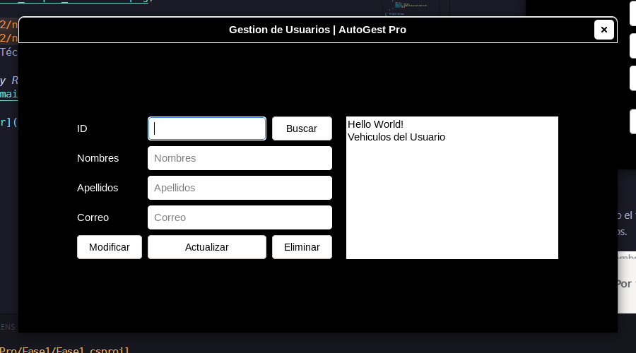

# Manual de Usuario - AutoGest Pro (Fase 1)

## Introducción

AutoGest Pro es una aplicación diseñada para la gestión de servicios automotrices, permitiendo el manejo eficiente de usuarios, repuestos, facturación y vehículos.

## Requisitos del Sistem

- Sistema Operativo: Windows 10 o superior
- .NET 8.0 o superior
- 4GB de RAM mínimo
- 500MB de espacio en disco disponible

## Instalación

- Clonar el repositorio del proyecto:  

```sh
    git clone https://github.com/edyrrg/-EDD-1S2025_201730511.git 
```

- Acceder a la carpeta del proyecto:

```sh
    cd AutoGest_Pro/Fase1
```

- Instalar las dependencias necesarias:

```sh
   dotnet restore
```

- Compilar el proyecto:

```bash
   dotnet build
```

- Ejecutar la aplicación:

```bash
   dotnet run
```

## Interfaz de Usuario

### Pantalla de Inicio

La pantalla de inicio presenta el formulario de inicio de sesión.

## Inicio de Sesión

Ingresar nombre de usuario y contraseña root.

Presionar el botón "Iniciar Sesión".

En caso de credenciales incorrectas, se mostrará un mensaje de error.


## Menú Principal

Desde aquí, los usuarios pueden acceder a las siguientes funcionalidades:

- Carga Masiva
- Ingreso Individual
- Gestion de Usuarios
- Generar Servicio
- Cancelar Factura
- Generar Reportes


## Carga Masiva

Permite al usuario root(Administrador) Cargar de manera masiva Usuarios, Vehiculos y/o Repuestos por medio de archivos JSON este debe de cumplir con lo requisitos estrictos de estructura que a continuación de ejemplifican:

```JSON
## Usuario
[
    {
        "ID": 1,
        "Nombres": "Juan",
        "Apellidos": "Pérez",
        "Correo": "juan.perez@mail.com",
        "Contrasenia": "123456"
    },
    {
        "ID": 2,
        "Nombres": "María",
        "Apellidos": "Gómez",
        "Correo": "maria.gomez@mail.com",
        "Contrasenia": "password123"
    }
]
## Vehículos
[
    {
        "ID": 1,
        "ID_Usuario": 1,
        "Marca": "Toyota",
        "Modelo": "Corolla",
        "Placa": "ABC123"
    },
    {
        "ID": 2,
        "ID_Usuario": 2,
        "Marca": "Ford",
        "Modelo": "Focus",
        "Placa": "XYZ456"
    }
]
## Repuestos
[
    {
        "ID": 1,
        "Repuesto": "Filtro de aceite",
        "Detalles": "Filtro de aceite para motor 1.8L",
        "Costo": 15.75
    },
    {
        "ID": 2,
        "Repuesto": "Bujías",
        "Detalles": "Juego de bujías para motor 2.0L",
        "Costo": 30.50
    }
]
```

## Ingreso Individual

Permite al usuario ROOT registrar de manera individual un nuevo Usuario, Vehiculo o Repuesto de manera individual.  


### Formulario de Registro Invidual

Cuando el usuario ROOT selecciona el registro que desea hacer se aperturara la siguiente vista de formulario para ingresar la informacion correspondiente al nuevo datos que desea crear.  


Es obligatorio llenar todo el formulario.
De lo contrario aparecera una advertencia indicando que existen llenar campos.


## Gestion de Usuarios

El usuario ROOT puede gestionar los usuarios permitiendo realizar los siguiente.  

- Buscar Usuario: busca el usuario por el identificador unico.
- Modificar: bloquea la informacion del usuario para poder actualizar seguidamente.
- Actualizar: Actualiza la informacion del usuario en cuestion poseterior a ser seteada la informacion actual, entonces actualiza los datos de usuario con los nuevo ingresados.
- Eliminar: Elimina el usuario despues de haberlo encontrado con el identificador correspondiente.
- El area de texto a la par del formulario de Usuario muestra los vehiculos del usuario consultado.



## Generar Servicio

En esta opcion se permite generar un servicio a un vehiculo con los identificadores de vehiculo y servicio, adicional es necesario agregar el detalle y costo total.  


El nuevo servicio se agrega a la cola.

## Cancelar Factura

Al clickear este boton se cancelara la factura que se contraba en pila y se mostrar la informacion del servicio con total pagado.


## Reportes

Se generan los reportes en .png en formato y se guardan en la carpeta [reportes](/reportes/) y ahi tambien se encuentra los archivos .dot  

Soporte Técnico

> *by Edy Rolando Rojas González - [3251938781401@ingenieria.usac.edu.gt](mail:3251938781401@ingenieria.usac.edu.gt)*

[Regresar](/README.md)
