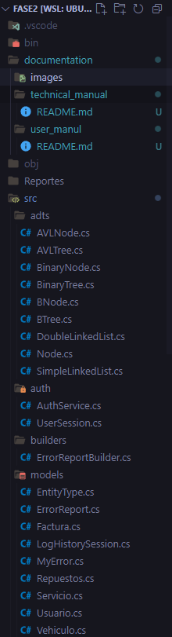
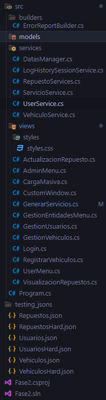
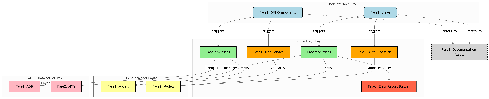

# Manul Tecnico | AutoGest Pro | Fase 2

## Descripción del Proyecto

AutoGest Pro es una aplicación de gestión de servicios automotrices que permite la administración de usuarios, vehículos, repuestos, servicios y facturas. La aplicación está desarrollada en C# utilizando .NET y GTK# para la interfaz gráfica de usuario.

Se aplica el paradigma de POO y tambien algunos patrones de diseño como la inyección de dependencias y singleton.

## Estructura del Proyecto

El proyecto está organizado en los siguientes directorios y archivos principales:

\*\* Podra observar a simple vista que la composición general del proyecto se ordena por cada una de las carpetas, esto permite entender a simple vista el proposito de general o una idea general de lo que encontrara dentro, por ejemplo en ` adts/ ` econtrara las estructuras de datos utilizadas en el proyecto.

A continuación se ampliara información sobre las clases que encontrara dentro de cada una de las carpetas.

## Diagrama del AutoGest_Pro | General

## Componentes Principales

1. Estructura de Datos (adts)
    - AVLTree.cs: Implementa un árbol AVL para la gestión eficiente de datos con balance automático.
    - BinaryTree.cs: Implementa un árbol binario de búsqueda para la organización jerárquica de datos.
    - SimpleLinkedList.cs: Implementa una lista simplemente enlazada para la gestión de datos lineales.
    - DoubleLinkedList.cs: Implementa una lista doblemente enlazada para facilitar la navegación en ambas direcciones.
    - BinaryTree.cs: Implementa un árbol binario de busqueda para inserciones y busquedas eficientes.
    - Node.cs: Implementa el nodo generico para almacenar los datos, SimpleLinkedList y  DoubleLinkedList hacen uso de Node.
    - AVLNode.cs: debido a que era necesario incluir propiedades especificas para manejar el peso y refencias a Left y Right se creo esta impmentacion para uso de AVLTree.cs
    - BinaryNode.cs: de la misma manera que con AVLNode.cs, BinaryNode.cs es la implementacion de Nodo para BinaryTree.cs

2. Autenticación (auth)
    - AuthService.cs: Servicios necesarios para el manejo de inicio se sesión de los usuario y el mismo Administrador.
    - UserSessions.cs: Clase dedicada para manejar las sesiones de los usuarios e inyectarlo en las vistas posteriores de la sesión del usuario.

3. Builder
    - ErroReportBuilder.cs: Haciendo uso del patron Builder se hace uso para generar reporte de errores cuando se carga archivos y se encuentras duplicados.

4. Modelos (models)
    - EntityType.cs: Enumerable para para identificar el tipo de entidad que dio error cuando se cargaba un archivo.
    - ErrorReport.cs: Clase que genera la lista de errores y los devuelve en texto para ser mostrado al usurio administrador.
    - Factura.cs: Modelo para las facturas.
    - LogHistorySession: Modelo para registro de entradas y salidas de los usuarios.
    - MyError.cs: Clase base que almacena el error encontrado en la carga masiva.
    - Repuestos.cs: Modelo para los repuestos.
    - Servicio.cs: Modelo para los servicios.
    - Usuario.cs: Modelos para los usuarios.
    - Vehiculo.cs: Modelo para los vehiculos.

5. Servicios (services)
    - DatasManager.cs: Clase que maneja y almacena los objetos de los servicios de las estructuras y el LogHistorySessions.
    - LogHistorySessionService.cs: Servicio que administra el historial de sesiones de los usuarios y su exportacion en tipo Json.
    - RepuestoService.cs: Servicio que administra la estructura de datos para Repuestos, el cual es un Arbol AVL, como inserciones, busquedas y generación de reportes.
    - ServicioService.cs: Servicio que adminstra la estructura de datos para Servicios.
    - UserService.cs: Servicio que administra la estructura de datos para Usuarios.
    - Vehiculo.cs: Servicio que administra la estructura de datos para Vehiculos.

6. Vistas (views)
    - ActualizacionRespuesto.cs: Interfaz para actualizar respuestos.
    - AdminMenu.cs: Interfaz para el menu del adminstrador.
    - CargaMasiva.cs: Interfaz para cargar entidades de Usuario, Vehiculo y Respuestos a traves de un archivos Json.
    - CustomWindow.cs: Clase Base Abstracta de las cuales heredan todas las demas interfacez usuario.
    - GenerarServicio.cs: Interfaz para crear servicios.
    - GestionEntidadesMenu.cs: Interfaz de Menu para seleccionar que entidad desea gestionar el usuario, vehiculo o usuario.
    - GestionUsuario.cs: Interfaz para gestionar los usuarios, buscar o eliminar.
    - GestionVehiculos.cs: Interfaz para gestionar los vehiculos, buscar o eliminar.
    - Login.cs: Interfaz principal para que los usuarios inicien sesión.
    - RegistrarVehiculos.cs: Interfaz para que el usuario normal registre sus nuevos vehiculos.cs.
    - UserMenu.cs: Interfaz del menu de usuario.
    - VisualizarRepuesto.cs: Interfaz para visualizar los respuestos en Post-Order, In-Order y Pre-Order.

7. Program.cs: Punto de inicio del programa.

## Entorno de Desarrollo

Entorno de desarrollo utilizado en AutoGest Pro  

1. **Visual Studio Code**
    - Versión: 1.98.2 (user setup)
    - Confirmar: ddc367ed5c8936efe395cffeec279b04ffd7db78
    - Fecha: 2025-03-12T13:32:45.399Z
    - Electron: 34.2.0
    - ElectronBuildId: 11161602
    - Chromium: 132.0.6834.196
    - Node.js: 20.18.2
    - V8: 13.2.152.36-electron.0
    - SO: Windows_NT x64 10.0.26100
2. **.NET SDK**
    - Version:           8.0.114
    - Commit:            54ac9c88f1
    - Workload version:  8.0.100-manifests.2d3000a2
    - Runtime Environment:
        - OS Name:     ubuntu
        - OS Version:  22.04
        - OS Platform: Linux
        - RID:         ubuntu.22.04-x64
        - Base Path:   /usr/lib/dotnet/sdk/8.0.114/
    - .NET runtimes installed:
        - Microsoft.AspNetCore.App 8.0.14 [/usr/lib/dotnet/shared/Microsoft.AspNetCore.App]
        - Microsoft.NETCore.App 8.0.14 [/usr/lib/dotnet/shared/Microsoft.NETCore.App]
3. **GTK**
    - v3.24.33
4. **Project 'Fase2' has the following package references [net8.0]**
    - DotNetGraph | 3.2.0
    - GtkSharp | 3.24.24.95

5. **Graphviz**
    - dot - graphviz version 2.43.0 (0)
    - libdir = "/usr/lib/x86_64-linux-gnu/graphviz"
    - Activated plugin library: libgvplugin_dot_layout.so.6
    - Using layout: dot:dot_layout
    - Activated plugin library: libgvplugin_core.so.6
    - Using render: dot:core
    - Using device: dot:dot:core
6. **WSL 2 | (Windows Subsystem for Linux)**
    - Versión de WSL: 2.4.11.0
    - Versión de kernel: 5.15.167.4-1
    - Versión de WSLg: 1.0.65
    - Versión de MSRDC: 1.2.5716
    - Versión de Direct3D: 1.611.1-81528511
    - Versión DXCore: 10.0.26100.1-240331-1435.ge-release
    - Versión de Windows: 10.0.26100.3194
7. **SO**
    - Edición Windows 11 Pro
    - Versión 24H2
    - Instalado el 14/02/2025
    - Versión del sistema operativo 26100.3194
    - Experiencia   Paquete de experiencia de características de Windows 1000.26100.48.0
8. **Hardware**
    - Nombre del dispositivo ryuk
    - Procesador 12th Gen Intel(R) Core(TM) i5-12400   2.50 GHz
    - RAM instalada 32.0 GB (31.7 GB usable)
    - Identificador de dispositivo D0A7005E-E4EC-4772-B8C9-3A6345BC06CE
    - Id. del producto 00330-80000-00000-AA075
    - Tipo de sistema Sistema operativo de 64 bits, procesador basado en x64
    - Lápiz y entrada táctil La entrada táctil o manuscrita no está disponible para esta pantalla

> *by Edy Rolando Rojas González - [3251938781401@ingenieria.usac.edu.gt](mail:3251938781401@ingenieria.usac.edu.gt)*

[Regresar](/README.md)
