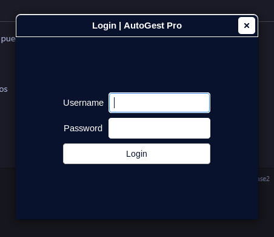
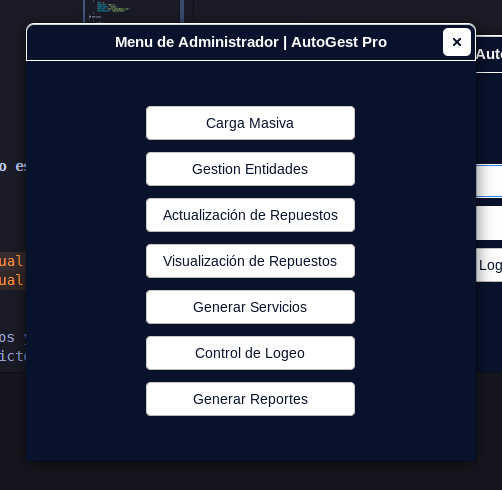
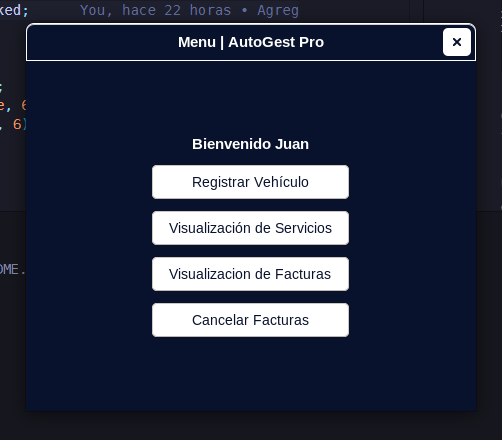
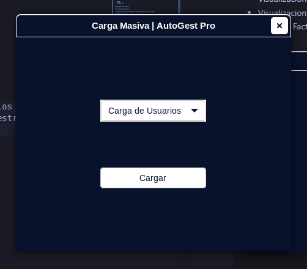
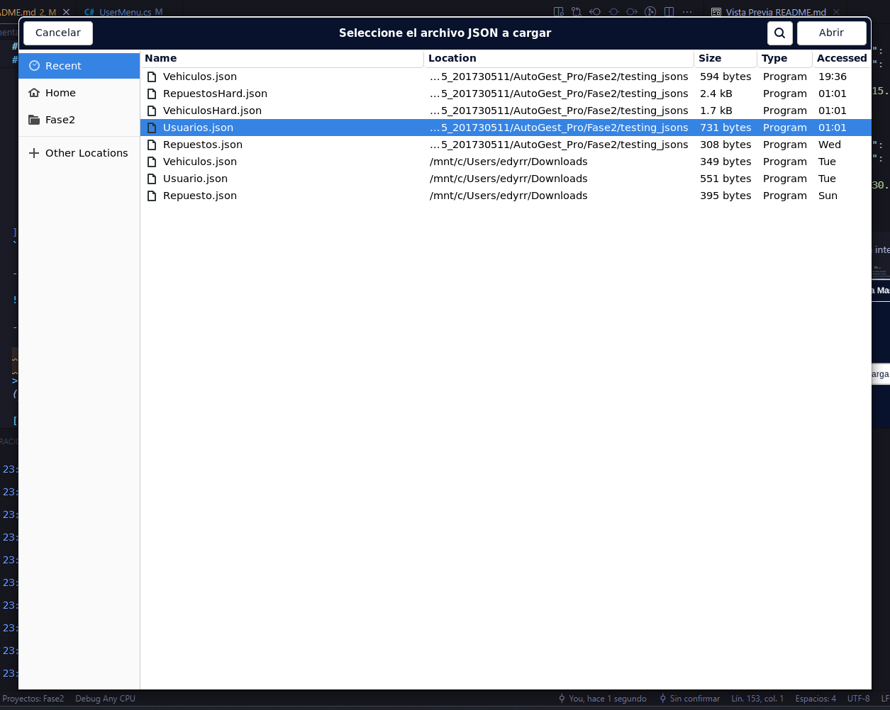
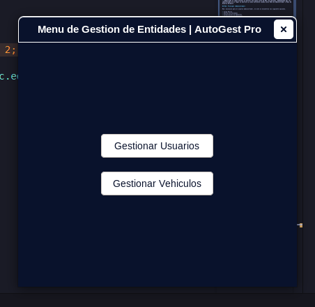
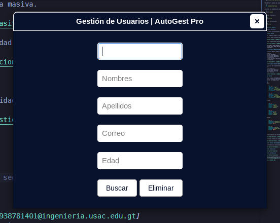
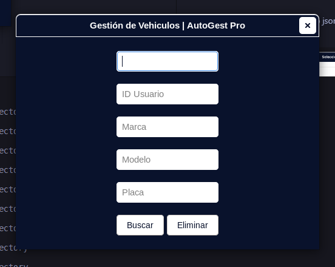
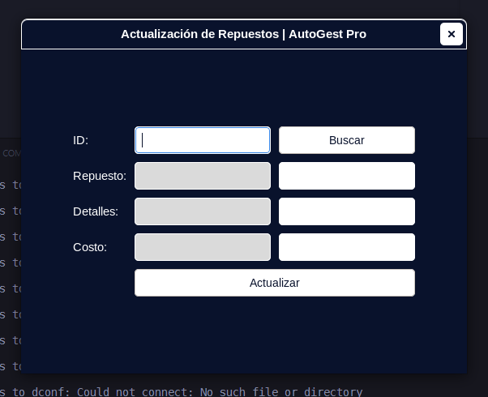

# Manual de Usuario | AutoGest Pro | Fase 2

## Introducción

AutoGest Pro es una aplicación diseñada para la gestión de servicios automotrices, permitiendo el manejo eficiente de usuarios, repuestos, facturación y vehículos.

## Requisitos del Sistem

- Sistema Operativo: Windows 10 o superior
- .NET 8.0 o superior
- 4GB de RAM mínimo
- 500MB de espacio en disco disponible

## Instalación

- Clonar el repositorio del proyecto:  

```sh
    git clone https://github.com/edyrrg/-EDD-1S2025_201730511.git 
```

- Acceder a la carpeta del proyecto:

```sh
    cd AutoGest_Pro/Fase2
```

- Instalar las dependencias necesarias:

```sh
   dotnet restore
```

- Compilar el proyecto:

```bash
   dotnet build
```

- Ejecutar la aplicación:

```bash
   dotnet run
```

## Interfaz de Usuario

### Pantalla de Inicio

La pantalla de inicio presenta el formulario de inicio de sesión.

## Inicio de Sesión

Ingresar nombre de usuario y contraseña root.

Presionar el botón "Iniciar Sesión".



En caso de credenciales incorrectas, se mostrará un mensaje de error.


- **Realizado un login exitoso se mostrar una nueva vista de Menú de opciones, dependiendo del rol identificado en el login se mostrara un menu diferente siendo estos Menu de Administrador o Menu de Usuario Normal**

## Menú Principal (Administrador)

Menú exclusivo para el usuario administrador, en este se encuentran las siguiente opciones.

- Carga Masiva
- Gestion de Entidades
- Actualización de Repuestos
- Visualizacion de Respuestos
- Generar Servicios
- Control de Inicio de Sesiones
- Generar Reportes



## Menu Principal (Usuario Normal)

Menu principal que visualizaran los usurios regulares de la aplicación, este tiene las siguiente opciones.

- Registrar Vehiculo
- Visualizacion de Servicios
- Visualizacion de Facturas
- Cancelar Facturas



## Carga Masiva

Permite al usuario root(Administrador) Cargar de manera masiva Usuarios, Vehiculos y/o Repuestos por medio de archivos JSON este debe de cumplir con lo requisitos estrictos de estructura que a continuación se ejemplifican:

```JSON
## Usuario
[
    {
        "ID": 1,
        "Nombres": "Juan",
        "Apellidos": "Pérez",
        "Correo": "juan.perez@mail.com",
        "Contrasenia": "123456"
    },
    {
        "ID": 2,
        "Nombres": "María",
        "Apellidos": "Gómez",
        "Correo": "maria.gomez@mail.com",
        "Contrasenia": "password123"
    }
]
## Vehículos
[
    {
        "ID": 1,
        "ID_Usuario": 1,
        "Marca": "Toyota",
        "Modelo": "Corolla",
        "Placa": "ABC123"
    },
    {
        "ID": 2,
        "ID_Usuario": 2,
        "Marca": "Ford",
        "Modelo": "Focus",
        "Placa": "XYZ456"
    }
]
## Repuestos
[
    {
        "ID": 1,
        "Repuesto": "Filtro de aceite",
        "Detalles": "Filtro de aceite para motor 1.8L",
        "Costo": 15.75
    },
    {
        "ID": 2,
        "Repuesto": "Bujías",
        "Detalles": "Juego de bujías para motor 2.0L",
        "Costo": 30.50
    }
]
```

- Vista Principal de la intergaz de carga masiva.



- Selección de arhivo json segun la entidad que se cargará en este caso usuarios.



## Menu de Gestion de Entidades

Menu intermedio para seleccionar que entidad se gestionara usuarios o vehiculos.



## Gestion de Usuarios

Interfaz para buscar usuarios o eliminarlos a traves de su ID.



## Gestion de Vehiculos

Interfaz para buscar vehiculos o eliminarlos a traves de su ID.



## Actualizacion de Repuestos



> *by Edy Rolando Rojas González - [3251938781401@ingenieria.usac.edu.gt](mail:3251938781401@ingenieria.usac.edu.gt)*

[Regresar](/README.md)
