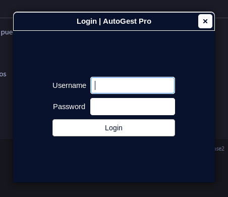
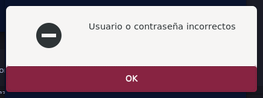
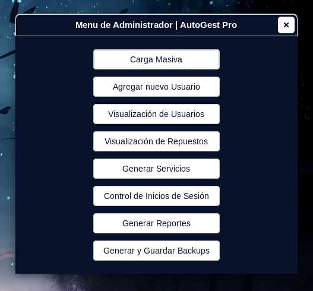
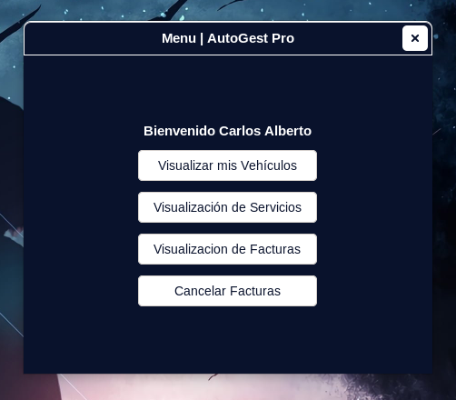
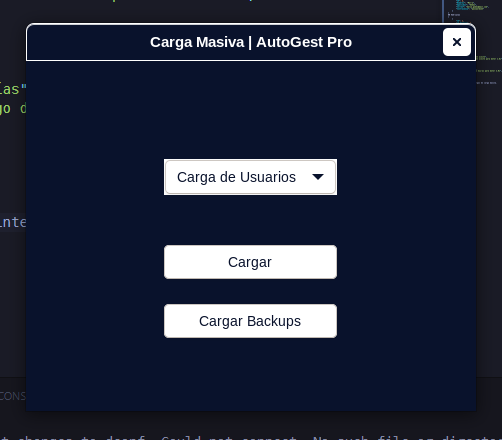
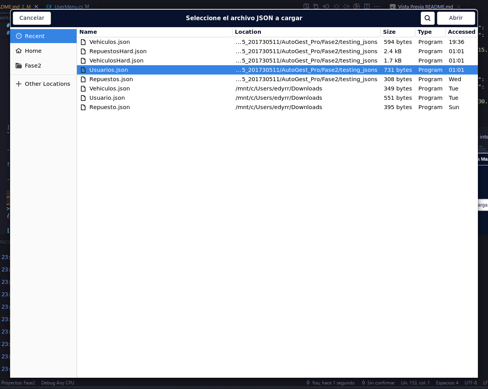
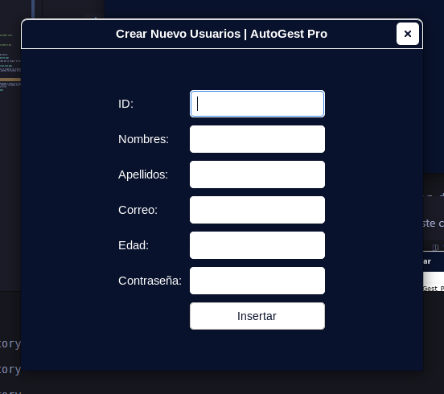
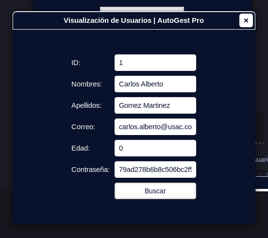
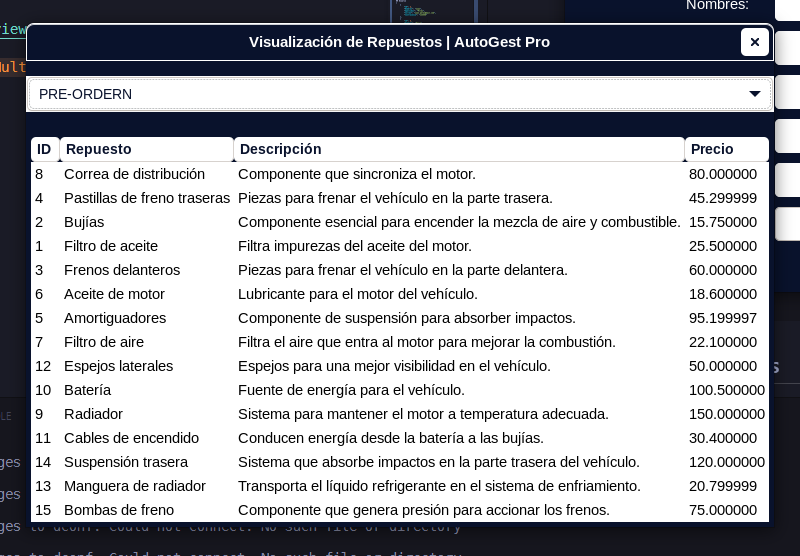
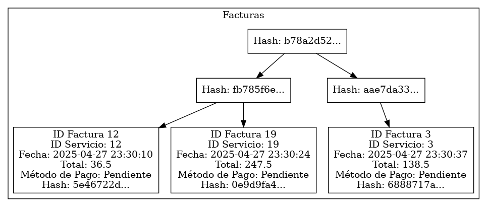

# Manual de Usuario | AutoGest Pro | Fase 3

## Introducción

AutoGest Pro es una aplicación diseñada para la gestión de servicios automotrices, permitiendo el manejo eficiente de usuarios, repuestos, facturación y vehículos.

## Requisitos del Sistem

- Sistema Operativo: Windows 10 o superior
- .NET 8.0 o superior
- 4GB de RAM mínimo
- 500MB de espacio en disco disponible

## Instalación

- Clonar el repositorio del proyecto:  

```sh
    git clone https://github.com/edyrrg/-EDD-1S2025_201730511.git 
```

- Acceder a la carpeta del proyecto:

```sh
    cd AutoGest_Pro/Fase2
```

- Instalar las dependencias necesarias:

```sh
   dotnet restore
```

- Compilar el proyecto:

```bash
   dotnet build
```

- Ejecutar la aplicación:

```bash
   dotnet run
```

## Interfaz de Usuario

### Pantalla de Inicio

La pantalla de inicio presenta el formulario de inicio de sesión.

## Inicio de Sesión

Ingresar nombre de usuario y contraseña root.

Presionar el botón "Iniciar Sesión".



En caso de credenciales incorrectas, se mostrará un mensaje de error.



- **Realizado un login exitoso se mostrar una nueva vista de Menú de opciones, dependiendo del rol identificado en el login se mostrara un menu diferente siendo estos Menu de Administrador o Menu de Usuario Normal**

## Menú Principal (Administrador)

Menú exclusivo para el usuario administrador, en este se encuentran las siguiente opciones.

- Carga Masiva
- Agregar nuevo Usuario
- Visualización de Usuarios
- Visualización de Respuestos
- Generar Servicio
- Control de Inicios de Sesión
- Generar Reportes
- Generar y Guardar Backups



## Menu Principal (Usuario Normal)

Menu principal que visualizaran los usurios regulares de la aplicación, este tiene las siguiente opciones.

- Visualizar mis Vehiculos
- Visualizacion de Servicios
- Visualizacion de Facturas
- Cancelar Facturas



## Carga Masiva

Permite al usuario root(Administrador) Cargar de manera masiva Usuarios, Vehiculos y/o Repuestos por medio de archivos JSON este debe de cumplir con lo requisitos estrictos de estructura que a continuación se ejemplifican:

```JSON
## Usuario
[
    {
        "ID": 1,
        "Nombres": "Juan",
        "Apellidos": "Pérez",
        "Correo": "juan.perez@mail.com",
        "Contrasenia": "123456"
    },
    {
        "ID": 2,
        "Nombres": "María",
        "Apellidos": "Gómez",
        "Correo": "maria.gomez@mail.com",
        "Contrasenia": "password123"
    }
]
## Vehículos
[
    {
        "ID": 1,
        "ID_Usuario": 1,
        "Marca": "Toyota",
        "Modelo": "Corolla",
        "Placa": "ABC123"
    },
    {
        "ID": 2,
        "ID_Usuario": 2,
        "Marca": "Ford",
        "Modelo": "Focus",
        "Placa": "XYZ456"
    }
]
## Repuestos
[
    {
        "ID": 1,
        "Repuesto": "Filtro de aceite",
        "Detalles": "Filtro de aceite para motor 1.8L",
        "Costo": 15.75
    },
    {
        "ID": 2,
        "Repuesto": "Bujías",
        "Detalles": "Juego de bujías para motor 2.0L",
        "Costo": 30.50
    }
]
```

- Vista Principal de la intergaz de carga masiva.



- Selección de arhivo json segun la entidad que se cargará en este caso usuarios.



- Cargar Backups: al presionar este boton se cargaran los archivos de las carpeta `/backups/`, en esta carpeta se guardan los backups de usuarios, vehiculos y repuestos.

## Agregar Nuevo Usuario

Formulario de ingreso para la creacion de un nuevo usurio, el ID deber ser unico, en el caso de que falten datos o el id este duplicado el sistema infomara del error.



## Visualizacion de Usuarios

Por medio del ID de usuario realiza la busqueda y muestra los datos del usuario consultado en el caso de que no existe o se cometa un error ingresando el ID el sistema advertira del error.



## Visualizacion de Repuestos

Se deplegara una nueva pestaña con todos los Repuestos actuales en el sistema, estos se pueden ordenar por medio de un combobox que permite hacerlo en PREORDER, INORDER, POSTORDER.



## Control de Inicio de Sesión

Genera un json que se guarda en Reportes que muestra el control de los logins realizados en el sistema.

Ejemplo:  

```json
[
  {
    "UserName": "Admin",
    "Entrada": "2025-05-02T05:16:16Z",
    "Salida": "2025-05-02T05:25:20Z"
  },
  {
    "UserName": "Carlos Alberto",
    "Entrada": "2025-05-02T05:25:40Z",
    "Salida": "2025-05-02T05:25:41Z"
  },
  {
    "UserName": "Admin",
    "Entrada": "2025-05-02T05:25:48Z",
    "Salida": "2025-05-02T05:25:50Z"
  },
  {
    "UserName": "Admin",
    "Entrada": "2025-05-02T05:25:58Z",
    "Salida": "2025-05-02T05:29:08Z"
  }
]
```

### Generar Reportes

Esta opción permite generar los reportes en `.dot` y exportarlos a `.png`.

Ejemplo:



### Generar y Guardar Backups

Genera y guarda los backups de los Usuarios registrados en el sistema, tambien de vehiculos y repuestos, estos posteriormente puede cargarse en el sistema previo a una validación e verificacion de integridad por parte del sistema.

> *by Edy Rolando Rojas González - [3251938781401@ingenieria.usac.edu.gt](mail:3251938781401@ingenieria.usac.edu.gt)*

[Regresar](/README.md)
