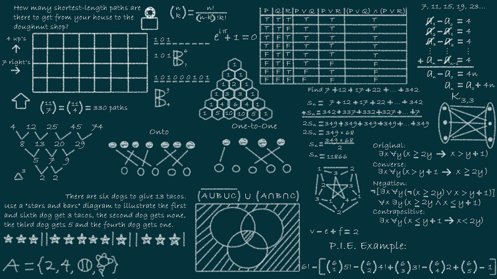

# 

# [EDD]1S2025_201730511

**Universidad San Carlos de Guatemala**  
**Facultad de Ingenieria**  
**Escuela de Ciencias y Sistemas**  
**Estrutura de Datos Sección "B"**

---

Repositorio para el curso de Estructura de Datos Sección B, Primer Semestre del año 2025

## AutoGest Pro

### AutoGest Pro | Fase 1

#### Documentación | Fase 1

- [Manual Técnico | Fase 1](./AutoGest_Pro/Fase1/documentation/technical_manual/README.md)
- [Manual de Usuario | Fase 1](./AutoGest_Pro/Fase1/documentation/user_manul/README.md)

### AutoGest Pro | Fase 2

#### Documentación| Fase 2

- [Manual Técnico | Fase 2](./AutoGest_Pro/Fase2/documentation/technical_manual/README.md)
- [Manual de Usuario | Fase 2](./AutoGest_Pro/Fase2/documentation/user_manul/README.md)

---
> *By. Edy Rolando Rojas González | 201730511*
